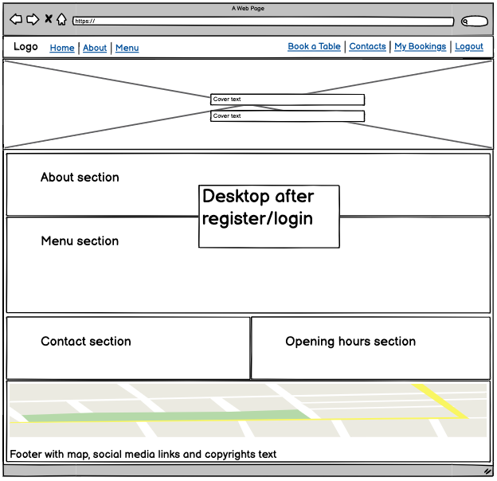
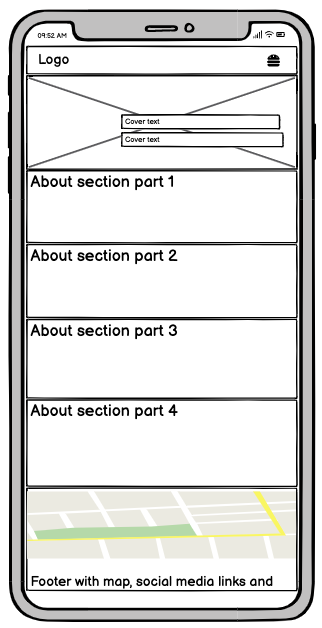
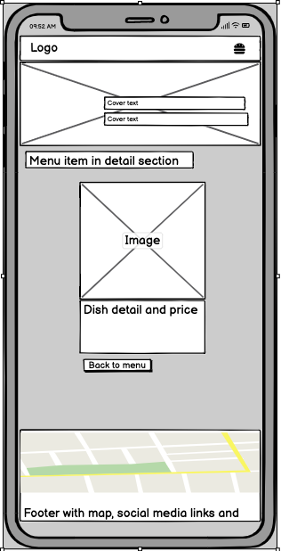
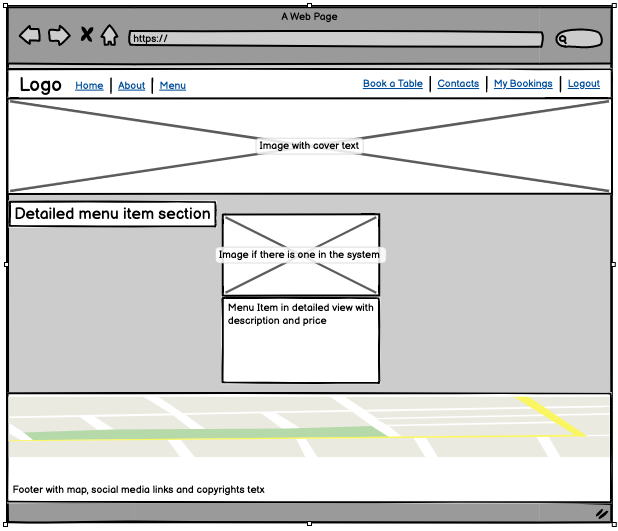
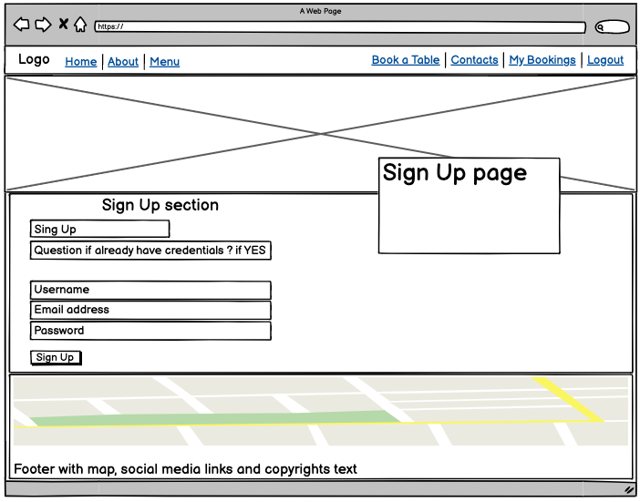

# Restaurant Cubaneros 

My project is a restaurant website which represents a traditional rustic cuban cuisine. The websites main features, as 'about', 'menu', contacts' displays the 'read' part of CRUD to the user and gives the important information about the websites goal to the user, while the admin can change and update the same information from the backend. The crucial part of the project is the 'book here!'(or the booking form) and 'my bookings' which gives the user/admin the possibility for 'create', 'update' and 'delete' in CRUD, so that a reservation/booking can be created, edited or removed. As admin these bookings can be approved or rejected and the status of this action reflects in the frontend presentation, which gives the user the possibility to follow up the status themselves.

The live deployed application can be found deployed on [Heroku]().

The link to my Github repository's [Github Repo](https://github.com/Balkaneros91/Cubaneros-PP4).

## CONTENTS

* [User Experience](#user-experience-ux)
  * [Agile](#agile)
  * [User Stories](#user-stories)
  * [Project stages](#project-stages)

* [Design](#design)
  * [Colour Scheme](#colour-scheme)
  * [Typography](#typography)
  * [Wireframes](#wireframes)

* [Features](#features)
  * [General Features on Each Page](#general-features-on-each-page)
  * [Future Implementations](#future-implementations)

* [Technologies Used](#technologies-used)
  * [Languages Used](#languages-used)
  * [Frameworks, Libraries & Programs Used](#frameworks-libraries--programs-used)

* [Deployment & Local Development](#deployment--local-development)
  * [Deployment](#deployment)
  * [ElephantSQL databse](#elephantsql-database)
  * [Cloudinary API](#cloudinary-api)
  * [Heroku deployment](#heroku-deployment)
  * [Local deployment](#local-deployment)
    * [Cloning](#cloning)
    * [Forking](#forking)

* [Testing](#testing)
  * [Responsiveness](#responsiveness)
  * [Manual testing](#manual-testing)
  * [Browser Compatibility](#browser-compatibility)
  * [Lighthouse](#lighthouse)
  * [W3C HTML Validator](#w3c-html-validator)
  * [JIGSAW W3C CSS Validator](#jigsaw-w3c-css-validator)
  * [JShint](#jshint)
  * [Code Institute Python Linter](#code-institute-python-linter)
  * [Chrome DevTools](#chrome-devTools)
  * [Known bugs](#known-bugs)
  * [Solved bugs](#solved-bugs)

* [Credits](#credits)
  * [Code Used](#code-used)
  * [Content](#content)
  * [Media](#media)
  * [Acknowledgments](#acknowledgments)

## User Experience (UX)

Users visiting the restaurants website are looking for a new place to explore. We are offering a real rustic traditional experiance to excape the luxuary fancy vibe but still a place to fine dine. 

The front page provides the user with all the necessary content so they could decide if that is the place they want to explore. If not authenticated they can access almost all the content of the page until it gets to the reservation part of it, for which authentication is required.

Everyone can enjoy their visit to our website because we have adjusted it and designed for all different screen sizes.

### Agile

The project is build using the agile methodology. Link to the project board: [here](https://github.com/users/Balkaneros91/projects/13/views/1)

### User Stories

I have created user stories based on the agile methodology and I have created them using the Githubs kanban. In the upcoming images the projects build-up process can be followed up throughout different stages.

### Project stages

### Stage 1

Click here to see the progress in KanBan:

### Stage 2

Click here to see the progress in KanBan:

### Stage 3

Click here to see the progress in KanBan:

### Stage 4

Click here to see the progress in KanBan:

### Stage 5

Click here to see the progress in KanBan:

### Last stage - done

Click here to see the progress in KanBan:

## Design

### Colour Scheme

I wanted to keep it simple and light. The color palette matches the cover image and is well suited color scheme for the full website.

[Coolors.co](https://coolors.co/) was the website I've used to fetch the colour palette presented.

### Typography

After I have applied the bootstrap CND I really liked the font style which came along with it and so I decided to just stick to it.

## Wireframes

[Balsamiq](https://balsamiq.com/wireframes) is used for wireframe design.

### Restaurant's Home Page

Click here!

#### Mobile

#### Desktop

#### Desktop

### About Page

Click here!

#### Mobile

#### Desktop

### Menu Page

Click here!

#### Mobile

#### Desktop

### Meal details page

Click here!

#### Mobile

#### Desktop

### Booking form

Click here!

#### Mobile

#### Desktop

### Booking confirmation

Click here!

#### Mobile

#### Desktop

### Contacts page

Click here!

#### Mobile

#### Desktop

### Bookings list

Click here!

#### Mobile

#### Desktop

### Edit bookings

Click here!

#### Mobile

#### Desktop

### Delete bookings

Click here!

#### Mobile

#### Desktop

### Sign in Page

Click here!

#### Mobile

#### Desktop

### Sign out Page

Click here!

#### Mobile

#### Desktop

### Sign up Page

Click here!

#### Mobile

#### Desktop

### Error Pages

Click here!

#### Mobile

#### Desktop

